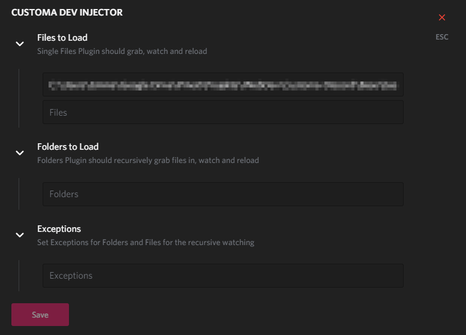

# Customa CSS Injector
This is a development plugin for Powercord, used for the plugin development of Customa.
## What does it do?
This plugin is for BD Theme developers. It lets you edit CSS live with your favorite text editor.
It lets you load files and folder, set exceptions for those
## Features
* Load Files or Folders
    * Define Exceptions for Folders or Files
* Easy Setup using the Settings Menu provided with Powercord
* Detects duplicate files and doesn't load them
* Unloads files on disabling
## How to use it?
1. Clone the repo into the plugins folder of Powercord using the following command:
```SH
git clone https://gitlab.com/Customa/pc-customa-dev-injector.git
```
2. a. Reload Discord<br>
b. Put the following command into the Discord dev console:
```JS
powercord.pluginManager.remount('pc-customa-dev-injector')
```
3. Go to the appropriate menu entry in Settings:<br>

4. Open the category you need and define exceptions when needed

5. Press Tab if you need more inputs
6. When you are done press Save

## Roadmap
* Make Settings work properly
* Add more Development Aids
* Add commands for easy injection
* Variable injection?

## Known Issues
* Settings **look** to be broken, but they do work!<br>
In case the last input displays a link, press Save and reload the menu item

Created by: [GhostlyDilemma](https://gitlab.com/GhostlyDilemma) @ [Customa](https://github.com/Customa)<br>
Original Idea: [Kosshi](https://github.com/kosshishub)